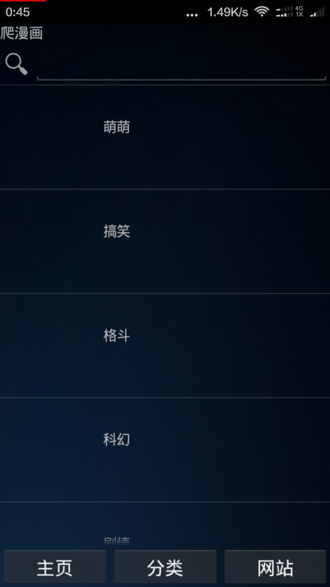
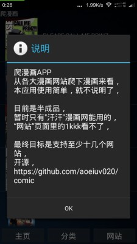

#爬漫画

##应用简介
这是有理想的漫画神器，  
【背景】  
市面上的漫画软件都是都是从特定的某个漫画网站下载漫画，  
有的漫画在这个网站没有，而有这漫画的网站可能没有相应的app，  
只能用浏览器看，体验很糟糕，  
【理想】  
根据简单的脚本分析出漫画网站的一切，  
然后爬出漫画，  
计划未来要支持大多数漫画网站，  
【涉及技术】  
1. 解析json,解析html,
2. Fragment实现多标签的Activity，
3. ListView和BaseAdapter的使用，
4. AsyncTask异步加载数据和图片，
5. 利用后台WebView处理javascript，

##预览版

实现了基本的功能，  
根据json爬漫画，  
1. 爬漫画网站的分类列表，  
2. 爬分类下的漫画，  
3. 爬搜索漫画的结果，  
4. 爬漫画详情信息，  
5. 爬漫画目录列表，  
6. 固定方法爬漫画页面，

最最重要的看漫画的功能却没能完全实现，  
因为漫画的页面都是用到javascript的，  
暂时没解决，只是用固定方法爬下了汗汗漫画网站，

