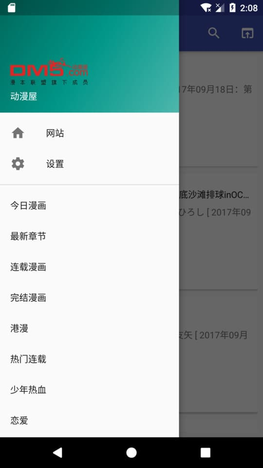

# 爬漫画

停止维护，可能合并到爬小说PaNovel，  

## 应用简介
突然意识到版权问题，正失去梦想成为咸鱼，  
本项目仅供开发者学习使用，侵删，  
不上线，不宣传，万一人多了也只能删了，  

目前支持三个网站，侵删，  
[漫画台](http://www.manhuatai.com)
[动漫屋](http://www.dm5.com)
[泡泡漫画](http://www.popomh.com)

【背景】  
市面上的漫画软件都是都是从特定的某个漫画网站下载漫画，  
有的漫画在这个网站没有，而有这漫画的网站可能没有相应的app，  
只能用浏览器看，体验很糟糕，  

【理想】  
一个类几个方法就分析出漫画网站的一切，  
然后爬出漫画，  
计划未来要支持大多数漫画网站，  

【库】  
kotlin + mvp + dagger2 + rxandroid  
[jsoup](https://github.com/jhy/jsoup)
[dagger2](https://github.com/google/dagger)
[RxAndroid](https://github.com/ReactiveX/RxAndroid)
[glide](https://github.com/bumptech/glide)
[anko](https://github.com/Kotlin/anko)
[MaterialSearchView](https://github.com/MiguelCatalan/MaterialSearchView)
[PinchImageView](https://github.com/boycy815/PinchImageView)
[slf4j](https://github.com/qos-ch/slf4j)

